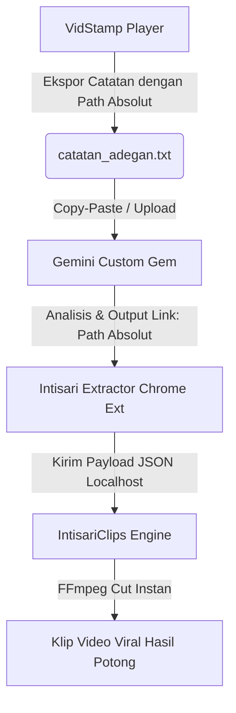

# Spesifikasi Kebutuhan Sistem (SRS): Integrasi Path Absolut Catatan Adegan

## 1. Pendahuluan
Dokumen ini menjelaskan spesifikasi sinkronisasi format berkas penanda adegan (`_catatan_adegan.txt`) yang dihasilkan oleh aplikasi **VidStamp** agar dapat disinkronkan secara mulus dengan **Gemini Custom (Intisari Viral Lens)** dan **Intisari Extractor (Chrome Extension)**.

## 2. Alur Integrasi Antar-Sistem (End-to-End Workflow)
Tujuan utama integrasi ini adalah memungkinkan pemotongan video otomatis berskala besar.
1. **VidStamp** (Player lokal) merekam klip/adegan dari file video lokal, lalu mengekspor berkas `_catatan_adegan.txt`.
2. Berkas ini diunggah/ditempel (*copy-paste*) ke **Gemini Custom**.
3. **Gemini Custom** membaca lokasi file video absolut dari header berkas teks tersebut, lalu meletakkan lokasi absolut ini pada baris `Link: [Path Absolut Video]` di `BAGIAN 2` (Clipper Script).
4. **Intisari Extractor** (Ekstensi Chrome) menangkap teks tersebut dari halaman browser Gemini dan mengirimkan payload JSON berisi path video absolut ke backend desktop **IntisariClips**.
5. **IntisariClips** langsung memotong video dari lokasi fisik yang tepat tanpa perlu menanyakan lokasi file video kembali kepada pengguna.



## 3. Spesifikasi Perubahan Format Header Teks
Sebelumnya, berkas ekspor teks hanya mencatat nama file saja. Untuk mendukung alur di atas, header berkas teks `_catatan_adegan.txt` wajib mencatat informasi fisik video secara detail dan presisi:

* **Video File Name**: Nama dasar berkas video (misal: `Solo_Leveling_S02E01.mp4`).
* **Video Abs Path**: Lokasi absolut berkas video pada harddisk lokal (misal: `E:\ANIME\Solo Leveling\Solo_Leveling_S02E01.mp4`).
* **Note Folder Name**: Nama folder penyimpanan catatan adegan (misal: `Solo_Leveling_S02E01_Catatan`).
* **Note Folder Path**: Lokasi absolut folder catatan (misal: `E:\ANIME\Solo Leveling\Solo_Leveling_S02E01_Catatan`).

### 3.1. Struktur Header Baru
```text
=================================================================
                  CATATAN ADEGAN & SUBTITLE
  Video File Name  : [Nama_Berkas_Video].[Ekstensi]
  Video Abs Path   : [Drive]:\[Path_Lengkap_Video]
  Note Folder Name : [Nama_Folder]_Catatan
  Note Folder Path : [Drive]:\[Path_Lengkap_Folder_Catatan]
=================================================================
```

## 4. Kriteria Keberhasilan
* Setiap kali adegan baru ditambahkan, dihapus, atau diekspor secara manual, berkas teks yang diperbarui wajib memiliki 4 baris metadata absolut di atas.
* Format teks ini dapat diparse secara akurat oleh Gemini Custom untuk menghasilkan instruksi pemotongan yang selaras dengan sistem ekstraksi klip viral.
